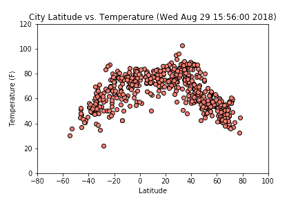
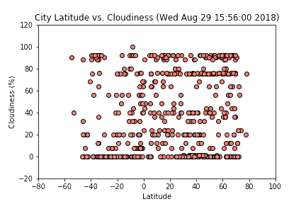
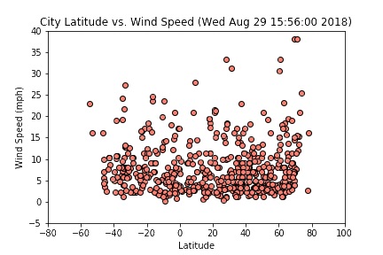

# What's the Weather Like?

## WeatherPy

In this project, I used Python requests, APIs, and JSON traversals to answer a fundamental question: "What's the weather like as we approach the equator?"

Using [citipy Python library](https://pypi.python.org/pypi/citipy) and the [OpenWeatherMap API](https://openweathermap.org/api), 500 cities were randomly selected based on latitude and longitude and a weather check on each cities was performed using successive API calls. The CSV of all data retrieved and png images for each scatter plot can be found in the [output_data folder](output_data) and [Images folder](Images) respectively.

The following scatter plots were built using [matplotlib.pyplot](https://matplotlib.org/api/_as_gen/matplotlib.pyplot.html) to visualize the relationship between weather and latitude:

+ Temperature (F) vs. Latitude
 

+ Humidity (%) vs. Latitude
 

+ Cloudiness (%) vs. Latitude
 

+ Wind Speed (mph) vs. Latitude
 

